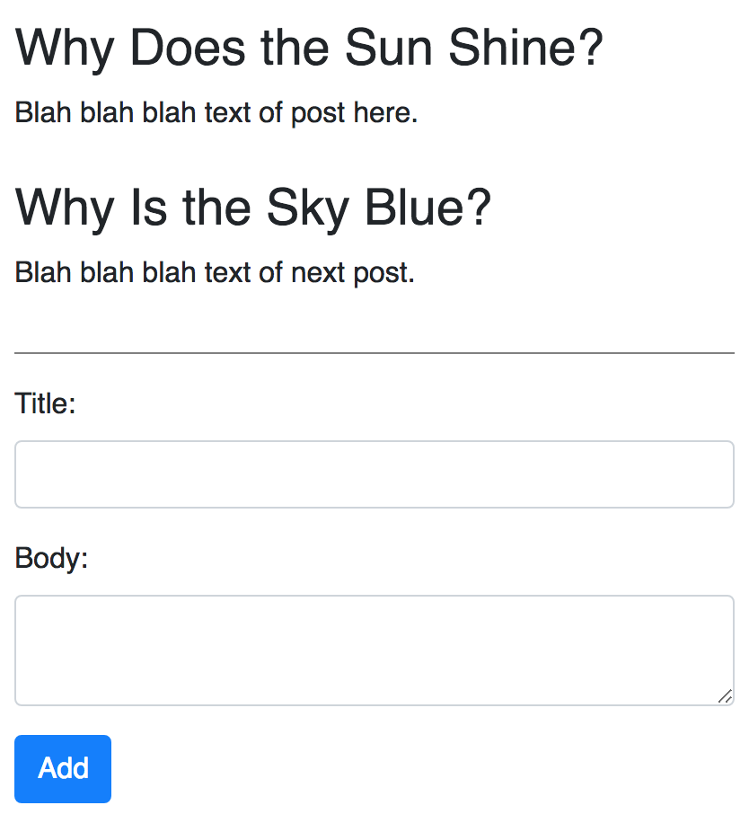
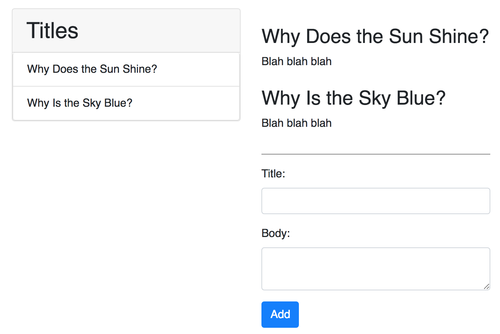

## Microblog!

It's time to build a small blogging application!

### Part I - React Components

Your application should contain the following components:

- App - should store some state which contains an array of posts and render the PostList and NewPostForm components
- NewPostForm - should allow for creating a title and a body. If either of these are empty when the form is submitted, display an error message.
- PostList - should list the Post components
- Post - should display the title and body of each post

### Part II - Title List

Your boss loves what you've built so far, but there's just one more thing that needs to get done! Your boss would like you to add another component that `App` renders called `TitleList`, which simply displays a list of all the titles of the posts.

It also turns out your boss **also really likes Redux**.

Move your list of posts from React state (from your App component) to Redux state (a store).

You could move the state up, but this is great time to not have to make `App` contain any state! Using Redux and React-Redux, connect your `TodoList` and `TitleList` component so that they can render the list of posts.

### Part III - Deleting Titles

Your boss is thrilled with the list of titles, but now there's just one more thing that needs to get done! Add functionality to delete an individual post (there should be delete buttons shown on the TitleList component and the BlogList component).

### Part IV - Next Steps

- Add functionality to edit posts
- Add functionality to comment on posts 
- Allow users to add comments 
- Allow users to remove comments 
- Allow users to delete comments
- Allow users to upvote posts
- Allow users to downvote posts
- Reorder posts based on their votes

### Part V - Using a backend to store todos

Your boss is so impressed with what you've built so far! It's now time to make sure you save your todos. Using the `backend` folder, fetch and store your todos using the API. You will need to use `redux-thunk` to handle asynchronous actions.

### Part VI - Using a backend to store comments

Now that you have posts working, try to add functionality for adding and removing comments with the API!

### Part VII - Next Steps

Add functionality on the backend to store votes for each post and allow upvotes/downvotes to be saved.

